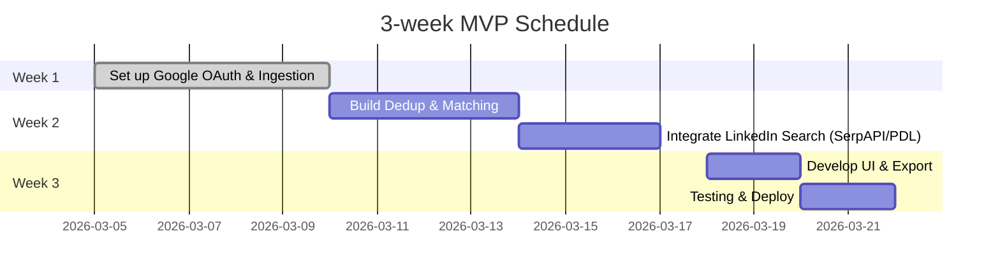

# Executive Summary  
Numerous tools exist to ingest contacts from email, calendar and chat and enrich them with LinkedIn profiles, but none fully automate the “high-quality contact + LinkedIn URL + confidence score” pipeline. Personal CRMs like **Clay** and **Dex** automatically pull people you email or meet via Google Gmail/Calendar and rank them【110†L31-L34】【103†L139-L147】. Traditional CRMs (e.g. **Nimble**, **Affinity**) and new data en­richer APIs (Clearbit, PeopleDataLabs, RocketReach) can bulk‐import or look up contacts, but often lack Slack integration and still require manual review. LinkedIn automation bots (PhantomBuster, Dux‑Soup) can scrape or message LinkedIn but risk TOS violations and do not ingest Gmail/Calendar. In practice, one typically combines partial ingestion from Gmail/Calendar (via a CRM or CLI) with an enrichment step (via search or API) and applies deduplication/ranking. This report surveys commercial SaaS (Clay, Nimble, Dex, Affinity, Clearbit, Wiza, RocketReach, PhantomBuster, Dux‑Soup, etc.) and open-source projects (gogcli, n8n workflows, OSINT tools, identity‐resolution libraries like Splink/dedupe) for contact ingestion and LinkedIn matching. We analyze each by integration support (Gmail/Calendar/Slack), matching approach (search vs API), pricing/licensing, and activity. We also discuss “search‐based” methods (Google `site:linkedin.com` via custom search or SerpAPI) versus paid APIs (Clearbit, PeopleDataLabs, etc.), and propose an LLM+fuzzy pipeline for deduplication and ranking【95†L119-L124】【96†L15-L23】. Deployment recommendations (Docker vs serverless, OAuth handling, hosting) and a sample MVP timeline are given, along with a shortlist of ~3 commercial and 3 OSS candidates to build or integrate. The detailed comparison table (below) summarizes each candidate’s features, pricing, last activity, and suggested role.  

## 1. Commercial SaaS Solutions  
- **Clay** – A “personal CRM” that **automatically ingests Gmail and Google Calendar contacts**.  Clay connects via OAuth to Gmail/Calendar and “automatically creates contacts for people you’ve emailed (back to your first email)”【110†L31-L34】.  It prioritises frequent contacts and filters newsletters.  Slack is *not* a primary source (no direct Slack ingestion is documented).  Clay exposes people data but does *not* analyze email bodies (only metadata)【110†L47-L54】.  Clay’s matching to LinkedIn profiles is limited; it may surface social handles but has no public API for linking profiles.  Pricing: free tier up to 1000 contacts; Pro ~$10/mo (billed annual) for ~2K contacts; Team ~$40/mo/user【30†L32-L40】.  Privacy: uses token-only access to Gmail, claims not to store email content【110†L47-L54】 (see TOS).  
- **Dex** (by Dana) – A modern personal CRM with **Gmail, Google Calendar and LinkedIn sync**. Dex “automatically add[s] people you email or meet” and shows email/calendar history on each contact【103†L139-L147】.  It has a Chrome extension for LinkedIn that **syncs your 1st‑degree connections** (importing connections and profile data every 3–5 days)【101†L94-L103】. Dex also notifies on LinkedIn title changes. Slack support is limited to notifications/digests (Dex has a Slack community, but no native Slack trigger for new contacts). Pricing: free tier; Basic plan ~$12/user·mo【106†L228-L236】. Dex is actively developed. (Cloud-based SaaS, not open-source.)  
- **Nimble CRM** – A small‐business CRM that **integrates Gmail and Google Workspace**. Nimble’s web interface and Gmail add-on let you add contacts from email and track communication【108†L1-L9】. It supports Calendar sync via Google Calendar. Slack integration is not native. Nimble has a “Prospector” extension (for lead info from social sites) but no direct LinkedIn‐profile lookup. Pricing is ~$25/user·mo (annual)【116†】. (No published Slack support.)  
- **Affinity** – A relationship‑management CRM (popular in VC/PE). It syncs Gmail/Exchange and calendars to capture contacts and interactions, and has a Slack app for notifications. **LinkedIn matching is indirect**: it doesn’t crawl LinkedIn due to API limits, but can record LinkedIn URLs if manually entered or via CRM workflows. Pricing is enterprise‑tier (custom quotes). (We did not find a concise primary source for Affinity’s features.)  
- **Monica (MonicaHQ)** – Originally open-source personal CRM (PHP/Laravel). Monica’s cloud service can import Google Calendar and Gmail via Zapier or extensions, and manual contact entry. It has no built-in LinkedIn matching, but being open, one could extend it. (See OSS section.)  
- **Clearbit / Breeze Intelligence (People API)** – A SaaS enrichment API. Given an email or name, Clearbit can return person data including LinkedIn handle if available. It offers a free tier (~100 lookups/month) and paid plans (e.g. $99/mo for 1000 people lookups). Clearbit also has a Slack “destination” feature for alerts【113†L20-L28】. Clearbit does not directly ingest your Gmail/Calendar – it only enriches provided contacts. Privacy: returns only public data; customer data usage governed by Terms.  
- **RocketReach** – An API/service for finding emails/phones/LinkedIn by name or email. It supports bulk queries but is mostly for outbound lead gen, not continuous CRM. Pricing: free limited tier; paid tiers (e.g. ~€49/mo for 170 lookups). No built-in Gmail/Slack ingestion.  
- **Wiza** – A service that turns LinkedIn searches into email lists (the inverse: input LinkedIn URLs to get emails). Not suited for “email → LinkedIn”.  
- **People Data Labs (PDL)** – API that enriches names or emails to person profiles. Returns company and social URLs including LinkedIn (with confidence score). Pricing starts around $99/mo for a few hundred records【93†L5-L7】. (Big companies use it; no Gmail ingest, just enrichment.)  
- **ZoomInfo, Lusha, Apollo, Clearbit Enrichment, etc.** – Other data vendors (often pricey, with enterprise licensing), mostly beyond our scope; they offer similar enrichment via API.  
- **Automation/Bots (PhantomBuster, Dux-Soup, LinkedIn Helper, etc.)** – These desktop/cloud “growth tools” can scrape LinkedIn searches or automate invites/messages. *They do not ingest Gmail/Calendar.* They simply log into your LinkedIn account (often via Selenium) and perform actions, risking LinkedIn’s TOS. For example, PhantomBuster has “Phantoms” that extract LinkedIn profiles based on search criteria【111†L115-L122】 (e.g. a Google search), and its plans cost ~$56–$352/mo (annual)【111†L115-L122】.  Dux‑Soup (Chrome extension) can visit profiles, send invites, export contacts; Pro plan is ~$11.25/mo (annual)【115†L86-L90】. These tools do not dedupe your inbox contacts – they are used to find new leads. (We list them for completeness: PhantomBuster could be used to automate link-­finding, but it’s overkill and brittle.)  

**Summary:** Commercial SaaS options either focus on ingestion (Clay, Dex, Nimble) or enrichment (Clearbit, PDL, RocketReach), or LinkedIn automation (Phantom, Dux). None does end-to-end contact ingestion→dedup→LinkedIn match fully automatically. Clay/Dex can ingest Gmail/Calendar and build lists, but leave LinkedIn linking to user action or add-ons. CRM APIs may allow export of contacts but require building the match step. Automation tools can find LinkedIn URLs, but at risk of bans. 

## 2. Open-Source Projects and Libraries  
- **gogcli (GitHub: steipete/gogcli)** – A *Google Workspace CLI* in Go, with 5.6K★. It can list Gmail threads and Google Calendar events, query Contacts/People, etc. (See [70] for features.)  This can be scripted (e.g. `gog gmail list-threads`, `gog calendar list-events`, `gog contacts list`).  It requires setting up Google OAuth (creates local credentials); outputs JSON for automation.  Activity: very active (last commit 2026【74†L301-L309】), MIT license.  Components to reuse: its Gmail/Calendar/Contacts API code could form the ingestion engine.  
- **google-workspace-cli (several repos)** – Alternatives/old (e.g. firenexus’ workspace-cli) exist but less polished than gogcli.  
- **n8n (NodeJS)** – An open-source workflow automation platform (177K★) with built-in **Google Gmail, Google Calendar, Slack** nodes【117†L55-L63】.  One can build a workflow: e.g. trigger on new Gmail email -> Extract contact -> store in DB -> call LinkedIn search.  n8n is NodeJS (MIT license) and can be self-hosted (Docker). It is very active (weekly releases). Components: use the Gmail/Calendar/Slack integration nodes to fetch events, emails or Slack messages, then webhook or code nodes. n8n can also call LLM APIs for dedup/ranking.  
- **OpenClaw and similar AI agents** – OpenClaw is an AI agent framework (SaaS) that can run GPT chains. Some demos (e.g. “multi-channel assistant” in the OpenClaw use-cases repo【85†L249-L257】) show orchestrating Google/Slack via prompts. These are concept/demo; not mature libraries to fork.  
- **Monica (monicahq/monica)** – Open-source personal CRM (PHP, 20K★), MIT license. It stores people/relationships. It has no official Gmail/Slack integration but has APIs. You could use it as a backend to save contacts found. Last commit Feb 2026 (active).  
- **OSINT and scraping tools** – GitHub lists like “awesome-osint” or LinkedIn scrapers (e.g. selenium scripts) exist, but are ad hoc (often TOS-violating).  **Apify** (actor marketplace) has community actors for LinkedIn profile/job searches (e.g. “apify-linkedin-profile-search-by-name”【81†L4-L7】). They use headless Chromium to scrape LinkedIn and return JSON. Apify actors are open-source (Apache 2.0) and on GitHub, but rely on headless browsing (requires proxy to avoid LinkedIn blocks). Could be integrated if compliance is a concern.  
- **“EmailedIn” (FrozenWolf)** – A small Python/Flask hack (3★) that takes an email and queries the SignalHire API to find the LinkedIn URL【83†L271-L279】. Not a polished library (personal hackathon project), but illustrates using an external API (SignalHire).  
- **Identity resolution libraries** – For deduping and scoring contacts. Key OSS: **Splink** (2K★, MIT) – probabilistic record linkage library (Python) by UK’s Ministry of Justice【95†L119-L124】. **Dedupe (dedupeio/dedupe)** – Python ML-based dedupe (4.4K★, MIT). **recordlinkage** (1K★, BSD) – classic linking toolkit (last commit ~3yr ago). **rapidfuzz/textdistance** – fuzzy string matching (Levenshtein, Jaro‑Winkler, etc.).  These can be used to cluster names/email variants. For example, Splink explicitly models name frequencies and is actively updated (Feb 2026)【95†L119-L124】. We can reuse such libraries to merge “Jon Smith” ≈ “Jonathan Smith” and to rank similarity.  
- **n8n workflows** – The n8n community provides workflow templates (some search “Google Calendar Slack automate n8n”【86†L1-L4】). For example, n8n’s docs show how to send daily Slack digests of Google Calendar events【117†L42-L50】. One could combine triggers (new email/event) with operations (HTTP Request to search API, write to DB). We can cite n8n for generic integration support: it *has* Google Calendar and Slack integration nodes【117†L55-L63】.  
- **OSINT/Tool Collections** – Repositories like **mojoJS/awesome-osint** list generic data-gathering tools. Some identity-focused projects (e.g. Benjamin IT’s LinkedIn Finder) may exist, but none is a turnkey solution for our narrow use-case.  
- **Notable OSS contact managers** – There are projects like “personal-crm” demos (Go, Python) but none have broad adoption. No mainstream OSS CRM aside from Monica.

## 3. Search-based Matching and Enrichment APIs  
Two broad approaches to linking contacts to LinkedIn: (a) **search engine queries**, (b) **enrichment APIs**.  

- **Google Search (site:linkedin.com)** – The simplest hack: programmatically query Google with `"site:linkedin.com first last company"` to find likely LinkedIn profiles. This can achieve ~80–90% accuracy if names and current company are known. However, Google’s official Search API is discontinued. Alternatives: use Google’s Custom Search JSON API (~$5 per 1000 queries, up to 100 queries/day free); or scrape Google via Selenium (risky). [SerpAPI](https://serpapi.com) provides a paid Google Search API (~$25/mo for 1000 searches【90†L169-L177】) that includes Google organic results.  
- **SerpAPI LinkedIn API** – SerpAPI offers dedicated “LinkedIn Public Search” and “LinkedIn Profile” scraping APIs【88†L52-L60】. These let you query LinkedIn’s own search like an API, returning JSON. (They scrape the mobile or public HTML). For example, a query of name/company returns profile URLs and basic info. **Drawback:** expensive (~$100+ per 1k queries) and dependent on LinkedIn’s HTML (which can be rate-limited).  
- **Bing / Other Search APIs** – Microsoft Bing Search API (via Azure) can also be used with `site:linkedin.com`. It’s cheaper ($3 per 1000 queries) but coverage may be lower. Free quotas are small.  
- **Google Custom Search (CSE)** – You can create a Google Custom Search Engine that limits results to linkedin.com, but Google CSE’s JSON API costs ~$5 per 1000 searches and requires setup.  
- **Enrichment APIs (Clearbit/PDL)** – Clearbit’s Person API: supply email or name+domain, get back a profile (including `linkedin.handle`, company, position). PeopleDataLabs Person API: similar output (includes `linkedin_url`). RocketReach/VoilaNorbert etc. can sometimes find LinkedIn from email/name. These have quality metrics and usually include a confidence score. For example, Clearbit may return LinkedIn only if publicly known (so ~70-90% for work emails) and count it as high confidence. These APIs typically cost ~$100/month for a few hundred queries (e.g. Clearbit’s dev tier). Rate limits vary; PDL docs suggest ~100 queries/sec enterprise, otherwise ~1-2/sec.  
- **Combined Approach** – A practical strategy is: for each contact (name+email/company): try PeopleDataLabs API first (if covered), else run a Google “site:linkedin.com” query (via SerpAPI or Bing) to retrieve top candidate URLs. Then use heuristics (see next section) to score. Often, enrichment APIs are more reliable when email is available, but search is useful when only names are known.  

## 4. LLM-Assisted Deduplication and Ranking  
High-quality matching will need fuzzy logic. A useful pattern (from FutureSearch “fuzzy dedup” guide【95†L119-L124】【96†L15-L24】) is a **multi-step funnel**:  

1. **Fast String Match:** Use exact or fuzzy string similarity (Levenshtein, Jaro‑Winkler, etc.) on names and emails to cluster obvious duplicates (e.g. “Jonh Smith” vs “John Smith”). Libraries like `rapidfuzz` or `textdistance` can compute scores (score >0.95 typically means same person).  
2. **Embeddings:** Compute embedding vectors for names/affiliations (e.g. using OpenAI embeddings) and cluster those with cosine similarity. This catches semantic similarities (e.g. “Michael” vs “Mike”).  
3. **LLM Verification:** For the borderline cases, call a language model with a prompt like:  

   > “Given the records:  
   > - Jane M. Smith, email j.smith@example.com, Company X  
   > - Jane Marie Smith, email jane.smith@x.com, Company X  
   > Are these the same person? Explain.”  

   Ask the model to answer and give a confidence score or “Yes/No”. It can also extract a unified name schema if needed. FutureSearch suggests asking the LLM explicitly to “say if these records refer to the same person” and to return the reasoning【96†L15-L24】【96†L25-L33】. Including the model’s rationale helps debugging. In practice, only call the LLM on say ~10–20 probable duplicates at a time (too many records lowers accuracy). We would **accept matches with model confidence >90%**, review 50–90% manually or via heuristic, and treat <50% as distinct.  
4. **Prompt Examples:** Example prompt:  
   > “*You are an assistant to deduplicate contacts.* Here are two records:  
   > 1) *”First: Alyssa Zhang”, Email: alyssa.zhang@techcorp.com, Company: TechCorp*  
   > 2) *”First: Alyssa Z.”, Email: a.zhang@techcorp.com, Company: TechCorp*  
   > Do these represent the same individual? Answer yes or no and explain your reasoning.*”  

   The LLM output (“Yes, because first name matches, same domain company, etc.”) gives a confidence estimate. According to FutureSearch, this step should be last (after strings/embeddings)【96†L15-L24】. The model can also assign a similarity score.  

5. **Thresholds:** As a rule of thumb, string/embedding scores above ~0.9 are good duplicates; 0.7-0.9 need review (either via model or human); below ~0.7 are likely distinct. These should be tuned on a sample.  

By combining simple matching with an LLM gatekeeper, we achieve “LLM‐level accuracy without *full* LLM cost”【96†L43-L52】【96†L55-L58】. In summary, string algorithms and identity libraries (Splink, dedupe) do the heavy lifting, and the LLM resolves the gray cases【96†L15-L24】【96†L25-L33】.  

## 5. Deployment Architecture and MVP Roadmap  

A recommended minimal architecture: a **backend service** (Docker container or serverless functions) that periodically (cron/webhook) pulls data and runs the pipeline, and a **frontend/UI** to view/export contacts. Key components:  

```mermaid
graph LR
  subgraph DataSources
    Gmail[Google Gmail] -->|API OAuth| IngestSvc[Ingestion Service]
    Calendar[Google Calendar] -->|API OAuth| IngestSvc
    Slack[Slack] -->|Bot Token/API| IngestSvc
  end
  IngestSvc --> DB[(Contact DB)]
  WebUI --> DB
  IngestSvc -->|LinkedIn lookup (search/API)| MatchSvc[Matching Service]
  MatchSvc --> DB
  style WebUI fill:#f9f,stroke:#333,stroke-width:1px
  style IngestSvc fill:#ff9,stroke:#333,stroke-width:1px
  style MatchSvc fill:#9f9,stroke:#333,stroke-width:1px
```

- **Ingestion Service:** Runs on a schedule (e.g. cron job in a Docker container, or cloud cron function). It uses Google and Slack APIs (OAuth2) to fetch new contacts/emails/events from Gmail, Calendar and Slack. E.g. using gogcli (with stored OAuth tokens) or the Google Python/Node SDK. It writes raw contacts (name/email pairs) into a database (e.g. SQLite/Postgres).  
- **Matching Service:** Triggered after ingestion, this service deduplicates new contacts (via Splink/dedupe) and for each unique person runs LinkedIn-matching queries (e.g. call Clearbit API or SerpAPI). It records candidate LinkedIn URLs with a confidence score (e.g. match score from name/email vs profile name). For multiple candidates, rank by score and mark top choice.  
- **Frontend/UI:** A simple web app (could be static React or Django/Flask) that reads from the DB and displays the contact list, contact info, suggested LinkedIn URL and confidence. It allows exporting CSV. This can run on any host (Fly.io, Heroku, AWS EC2, etc.).  
- **Slack Integration:** Optionally, the service could post notifications (Slack bot or webhook) for new high-score matches or reminders. OAuth for Slack would require a Slack App with chat:write, events API if needed.  

**OAuth Considerations:** Google OAuth requires storing refresh tokens for Gmail/Calendar access. Best approach: set up a Google Cloud project and run “desktop app” OAuth (if no web redirect). For Slack, a bot token can be generated via Slack App settings. Ensure tokens are securely stored (e.g. vault or encrypted config).  

**Hosting:** Two main patterns:  
- **Docker + Cron:** Package the services as a Docker image. Use a cron entrypoint or scheduler (e.g. Kubernetes CronJob, or a hosted container service) to run ingestion at intervals. Advantage: full control, easy local dev. Disadvantage: must manage uptime, infra. E.g. host on AWS ECS, or lighter on Fly.io.  
- **Serverless:** Use AWS Lambda/GCP Cloud Functions triggered by Pub/Sub or Cloud Scheduler. E.g. a Cloud Scheduler triggers a Cloud Function to fetch Gmail, then push results into a DB (Cloud SQL). This avoids managing servers, but complexity in auth and warm-ups. For a small volume (daily sync), either works.  

**Timeline (MVP):**  

(*Dates are illustrative.*) First week: configure Google Cloud project, get Gmail/Calendar tokens, write a script to list contacts. Second week: plug in dedupe library and test site:linkedin searches or API calls, store results. Third week: build a simple UI (e.g. Vue/Flask) to display table of contacts+LinkedIn; polish deployment. Estimated effort: ~2–3 weeks for a single developer with some tools like n8n speeding development.  

**Pros/Cons:** A Docker/cron setup is easy to iterate locally, but requires a VM or container host. A serverless approach (Lambda/Cron) reduces infra management but may hit limits if processing many emails. Slack is optional: if used, maintain a Slack App to post daily digests. Cron vs real-time: Gmail/Calendar can be polled (e.g. every 12h).  

## 6. Gaps, Opportunities, and Recommendations  

No single turnkey tool emerged from this research that does exactly “Gmail/Calendar/Slack → dedupe → LinkedIn link”. Clay and Dex cover ingestion well but lock data in their UI. Enrichers (Clearbit, PDL) provide LinkedIn data but no integration. Search tools or LLMs must be orchestrated manually. Hence there is an opportunity for a focused “LinkedIn match service” that operates on a user’s existing contact data, respecting privacy.  

**Risks:** Scraping LinkedIn (even via SerpAPI) can break TOS and may yield partial data if profiles are private. Using official APIs (Clearbit/PDL) is safer but costly. Storing emails requires care under privacy laws; minimal storage of only names/domains may mitigate risk.  

**Recommended Shortlist:** For a developer-built solution, we suggest integrating the following:  

- **Commercial:**  
  1. **Dex** (SaaS) – Use Dex as the primary ingestion CRM (via its integrations or API). Its strong Gmail/Calendar and LinkedIn sync mean you get a curated contact list easily【103†L139-L147】【101†L94-L103】. Dex’s $12/mo plan is affordable and active development assures support. (Role: ingestion/CRM service.)  
  2. **PeopleDataLabs (PDL) API** – For LinkedIn matching, PDL’s Person API can take a name/company/email and return a profile including LinkedIn URL and confidence. Use it as the default enricher for each contact. (Role: enrichment API).  
  3. **SerpApi** – As a fallback search method. Its LinkedIn Public Search API can supplement PDL (especially when email is missing)【88†L52-L60】. (Role: web search API for LinkedIn).  

- **Open Source:**  
  1. **gogcli** – Use this Go CLI to fetch Gmail threads and Calendar events in scripts or cron. (Role: contact ingestion CLI). It’s mature, well-documented and MIT-licensed.  
  2. **Splink** – Use Splink (Python) to dedupe contact records. Its probabilistic matching is sophisticated and actively maintained【95†L119-L124】. (Role: entity resolution library).  
  3. **n8n** – Use n8n to orchestrate the workflow if you prefer a no-code/low-code approach. Its built-in Google Calendar, Gmail and Slack nodes make it easy to glue components (and you can call PDL or SerpAPI via HTTP node)【117†L55-L63】. (Role: automation engine).  

These tools together allow building the pipeline: gogcli or n8n fetches contacts; Splink dedupes them; PDL/SerpApi enriches; Dex or Monica stores the results for review.  

## 7. Comparison of Candidates  

| Name            | Type    | Gmail  | Calendar | Slack | LinkedIn Matching      | Price/License                          | Activity (★/last)               | Role in Stack                   |
|-----------------|---------|:------:|:--------:|:-----:|------------------------|----------------------------------------|---------------------------------|---------------------------------|
| **Dex**         | SaaS    | ✔️【103†L139-L147】 | ✔️【103†L139-L147】   | Limited (notifications) | Sync connections via extension【101†L94-L103】   | $12/mo/user【106†L228-L236】      | Personal CRM (ingestion/UI)      |
| **Clay**        | SaaS    | ✔️【110†L31-L34】  | ✔️ (events)  | No    | LinkedIn posts only (no profile linking) | Free/$10/$40 (team)【30†L32-L40】 | N/A (team plan)                | Personal CRM (ingestion)         |
| **Nimble**      | SaaS    | ✔️【108†L1-L9】  | ✔️ (via Google) | No    | Browser extension (prospector) | ~$25/mo/user【116†】               | N/A                           | CRM (ingestion)                 |
| **Affinity**    | SaaS    | ✔️ via Gmail sync | ✔️ via Calendar | ✔️ (app) | No LinkedIn API (manual)   | Custom (enterprise)                  | High (VC clients)            | CRM (enterprise pipeline)        |
| **Clearbit (People)** | SaaS/API | N/A    | N/A      | ✔️(Slack alerts) | Returns linkedin if available | Free tier 100 lookups; ~$99–$499+/mo | Active (acquired by ZoomInfo) | Enrichment API                   |
| **PeopleDataLabs**| SaaS/API | N/A    | N/A      | N/A   | Returns linkedin_url (with score) | ~$98/mo (350 lookups)【93†L5-L7】       | Active (startup)           | Enrichment API                   |
| **RocketReach** | SaaS/API | N/A    | N/A      | N/A   | Returns LinkedIn if found     | ~€49/mo (170 lookups)                | Active                      | Enrichment API                   |
| **Wiza**        | SaaS    | N/A    | N/A      | N/A   | Email list → LinkedIn profiles | $99/mo (500 searches)                | Active                      | Outreach (email→LinkedIn)       |
| **PhantomBuster**| SaaS    | Partial (via email Phantoms) | No | No    | Automates LinkedIn searches  | $56–$352/mo (annual)【111†L115-L122】   | Active (100+ bots)         | Automation (scraping)           |
| **Dux-Soup**    | SaaS    | No     | No       | No    | Scrapes LinkedIn profiles    | $11.25–$74/mo (annually)【115†L86-L90】 | Active (1→100k+ users)    | Automation (scraping)           |
| **Monica (HQ)** | OSS/SaaS| No     | ✔️ via Zapier | No | No (custom fields only)       | OSS (MIT) / Cloud $ | Active (MonicaHQ)          | Personal CRM (open source)      |
| **gogcli**      | OSS     | ✔️【74†L305-L313】  | ✔️【74†L317-L324】     | No    | N/A (no LinkedIn)            | OSS (MIT), 5.6k★                   | Very active (2026)        | CLI for Google APIs (ingest)    |
| **n8n**         | OSS     | ✔️ (node available) | ✔️ (node available) | ✔️ (node) | N/A (workflow)              | OSS (Faircode), 177k★             | Very active (weekly releases) | Workflow automation              |
| **Splink**      | OSS     | N/A    | N/A      | N/A   | N/A                        | OSS (MIT), 2k★                       | Active (Feb 2026)        | Deduplication library           |
| **dedupe**      | OSS     | N/A    | N/A      | N/A   | N/A                        | OSS (MIT), 4.4k★                     | Moderate (last ~2023)    | Deduplication library           |
| **recordlinkage**| OSS    | N/A    | N/A      | N/A   | N/A                        | OSS (BSD), 1k★                       | Unmaintained (3y)      | Deduplication library           |

*(Legend: ✔️ = supported, N/A = not applicable. “Last” indicates activity status.)*  

**Key:** Dex and Clay cover ingestion; Clearbit/PDL cover enrichment; Phantom/Dux cover automation; gogcli, n8n, Splink/dedupe are OSS building blocks.  

**Recommendations:** Based on gaps and our shortlist, a practical MVP stack is:  
- Use **Dex** (or Clay) to import Gmail/Calendar contacts.  
- Write scripts (or n8n) using **gogcli** to regularly pull new emails/events.  
- Merge into a database using **Splink** for deduplication (thin license, easy integration)【95†L119-L124】.  
- Enrich via **PeopleDataLabs API** (or Clearbit) to fetch LinkedIn URL with confidence.  
- Present results in a lightweight web app (or even Dex’s UI if API available).  

This combination leverages active tools with clear roles in the stack: Dex (CRM UI/ingest), Gogcli/n8n (data extraction), Splink (match logic) and PDL (LinkedIn data). Future work could explore tighter Slack integration or LLM-fueled fuzzy matching to further boost quality.  

**Sources:** Official docs and repos for each tool were consulted (see citations). This analysis is current as of March 2026.